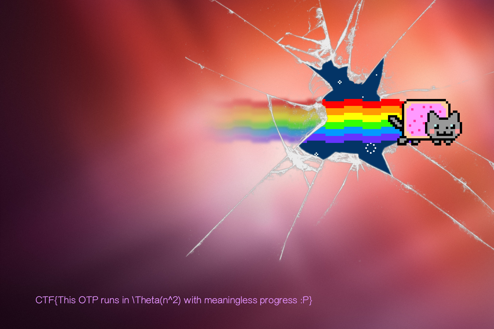

# OTP (crypto 300)
##### team: sblan
##### participant: 廖唯辰 (r04922161)
## Description
```
One-time pad has perfect secrecy...?
https://www.dropbox.com/s/314w5a5hntqhn8l/otp.zip?dl=0
```
## Solution
1. 題目利用執行檔的參數傳入 key，再基於這個 key 做一堆後續運算來做 OTP  
2. 給定檔案為 `flag.png.encrypted`，可見原來是 `png` 檔案，根據 png header 得知原始明文前 8 個 bytes 的 hex 為 `89 50 4e 47 0d 0a 1a 0a`  
3. `flag.png.encrypted` 前面 8 個 bytes 的 hex 為 `a4 49 ad 56 d2 a3 51 7b`  
4. 利用上述數據嘗試爆破出 key，發現 `key = 1618033988`。  
5. 代入 key 之後發現解密時間太長，推測是演算法太慢，需要優化。

----

觀察反組譯片段，會發現整份程式會把 key 不斷的做 `key = (1103515245 * key + 12345) & 0x7FFFFFFF;`  
再來觀察到下面的片段
```
do
{
    v9 = (1103515245 * v9 + 12345) & 0x7FFFFFFF;
    --v13;
}
while ( (HIDWORD(v13) & (unsigned int)v13) != -1 );
```
這裡可以發現如果 `v13` 很大，那光是這一個字元的 key 就要算很久。  
而由於 `1103515245` 和 `2^31` 互質，其實整個 state 轉換的循環節就是 `2^31`。  
因此嘗試將整個 state 轉換表建出。  
```
int state = 1618033988;
for (long long i=0; i<(1LL<<31); i++) {
    st.push_back(state);
    state = (1103515245 * state + 12345) & 0x7FFFFFFF;
}
```
建表之後整個演算法就可以利用查表從 `O(n^2)` 降為 `O(n)`。  
這裡用 C++ 寫，就不用處理繁瑣的 overflow 問題，整個加密演算法 code 也幾乎可以照搬。  
但需小心反編譯出來的 C code 可能有 bug，若有地方怪怪的看 assembly 可以釐清問題。  
總共大概需要 4G 的 RAM，應該是輕鬆愜意。
```
./sol < flag.png.encrypted > flag.png
```
最後得到 `flag.png`  

  

flag 為 `CTF{This OTP runs in \Theta(n^2) with meaningless progress :P}`
